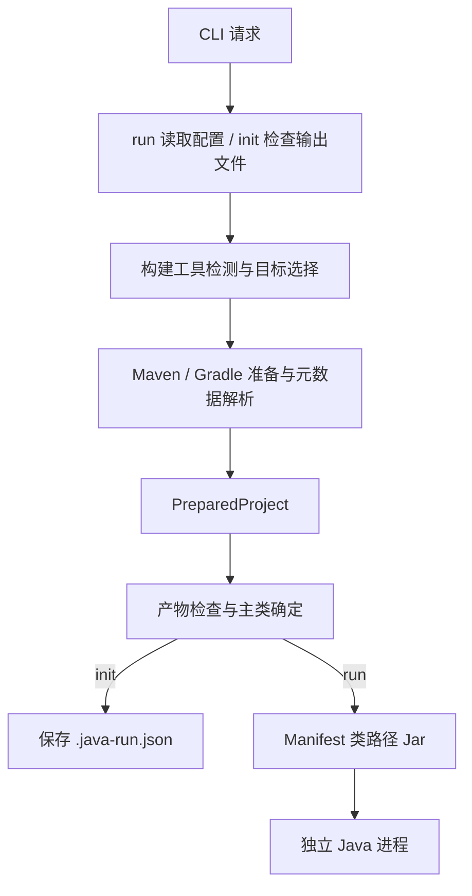

# java-run 架构与运行契约

java-run 是框架中立的 Java 源码工作区运行器。
它把选择项目、准备产物、确定入口和启动独立 JVM 组织成统一流程。
构建模型、依赖版本和项目任务由 Maven 或 Gradle 裁决。

运行契约基于 classpath，适用于普通 main 和 Spring Boot 等 Java 应用。
框架参数通过 JVM 参数或应用参数传入，框架类型不进入核心配置。

使用方式见 [README](../README.md)，验证与发布流程见 [贡献指南](../CONTRIBUTING.md)，后续目标见 [技术路线](roadmap.md)。

## 运行目标与入口

一次请求对应一个构建项目和一个主类，`init` 保存的配置也对应这个单一目标。
多模块工作区中的项目可能是应用，也可能是库。
存在编译输出或应用了 Java 插件，都不能证明项目具有可运行入口。

目标和入口分两步确定：

1. 发现候选项目：Maven 列出有效 reactor 中的 jar 项目，Gradle 列出主构建中应用了 Java 插件的项目。
2. 准备选定项目：按显式主类、构建声明、已编译入口的顺序确定主类。

自动发现只扫描目标项目输出，识别传统的 `public static void main(String[])`。
唯一入口自动采用；多个入口需要选择；没有入口时报告错误。
显式主类和构建声明的主类会校验名称格式，实际可加载性和方法有效性由 Java 启动器确认。

### 交互选择

标准输入与标准错误均为终端且允许交互时，CLI 可以展示模块或主类菜单。
支持按键模式时使用方向键、输入筛选和滚动；纯文本模式或受限终端使用序号输入。
菜单始终写入 stderr，展示文字和补充说明用于筛选，选择结果保留候选的稳定标识。
唯一候选自动采用；EOF、Ctrl+C 或 SIGINT 取消返回 130，SIGTERM 返回 143。

- `run` 使用本次选择启动应用
- `init` 在准备和选择成功后保存结果
- 非交互环境、CI 或 `--no-interactive` 下存在歧义时，通过 `--module` / `--main` 明确指定；`run` 也可读取项目配置

菜单只补齐目标和入口，运行参数由选项或配置提供。

候选发现会运行构建工具。
Gradle 配置期间可能准备 `buildSrc` 或 included build 的构建逻辑。
发现步骤本身不主动编译候选应用、解析其运行依赖或读取主类 Provider。

## 请求与命令流程

准备流程使用三个数据契约：

| 契约 | 职责 |
| --- | --- |
| `RunConfig` | 表达工作目录、运行目标、参数和构建策略 |
| `BuildPlan` | 描述执行构建工具前的静态命令、工作目录和准备说明 |
| `PreparedProject` | 保存构建工具裁决的目标输出、有序类路径、主类、启动 JDK 和默认 JVM 参数 |

### 配置来源

`run` 和 `plan` 读取 `--cwd` 指定的工作区根目录中的 `.java-run.json`。
配置定位只执行一次，不向父目录查找，也不在选定模块后重新读取。

- CLI 标量覆盖文件配置
- CLI 参数数组追加到文件数组之后
- 项目配置保存可复用的目标、参数和准备策略
- `--cwd`、`--java` 和 `--build-command` 由 CLI 指定，不写入项目配置

终端呈现选项同样只作用于当前调用。
`--log`、`--plain`、`--no-animation` 和 `--no-interactive` 不进入项目配置或 `plan` 的 JSON 结构。

`init` 使用 CLI 请求准备目标、检查产物并确定主类。
生成的配置记录实际构建工具、模块和主类、显式参数数组，以及非默认的构建策略和测试类路径设置。
构建声明的默认 JVM 参数仍由构建工具提供。

### 执行与保存

运行与初始化共用目标选择、项目准备和主类确定流程：



初始化写入遵循以下规则：

- 执行外部命令前检查目标文件，默认拒绝覆盖已有配置
- `--force` 使用本次选项重新生成，忽略旧配置，也可替换损坏的 JSON
- 取消、准备失败或入口无法确定时保留原文件
- 保存时再次检查目标，通过同目录临时文件完整写入后发布；目录和符号链接不能作为覆盖目标

初始化会执行构建准备，但不启动应用 JVM。

### 静态命令

`plan` 只读取本地构建文件和配置，输出准备步骤及待解析信息。
它不执行构建工具、不创建临时目录、不交互，也不验证有效模型、主类或依赖文件。

`help` 和 `version` 只解析 CLI 参数，不读取项目配置。

## 模块职责与依赖

```text
src/
├── cli.ts          请求编排、退出结果与临时工作区生命周期
├── cli/            参数和配置读写、帮助、终端选择与准备过程呈现
├── build-tools/    构建工具检测、Maven 与 Gradle 适配器
├── core/           运行契约、类路径、主类发现与 Java 启动
├── process/        外部进程、环境覆盖、编码检查与信号处理
├── logging/        日志级别、来源上下文、结构化记录与有序交付
└── terminal/       终端能力与偏好策略、活动计时和日志呈现
```

CLI 调用构建适配器完成准备，适配器返回统一的 `PreparedProject`。
核心模块检查该结果并确定主类，供 `run` 启动 Java 或 `init` 保存配置。

CLI 协调终端交互，核心模块通过调用方提供的选择函数确定入口。
核心模块不依赖终端菜单，进程模块不判断 Maven 或 Gradle 项目语义。

构建适配器提供静态计划、候选发现和项目准备函数。
模型读取、目标定位和任务图的差异由各适配器处理。
Maven 的有效模型类型与依赖文本解析位于 Maven 适配器，核心模块只消费准备结果。
新增构建系统或运行模式时，以真实项目和准备结果契约确定接口。

### 日志记录与来源上下文

`logging` 是独立的日志模块，使用 Consola 处理级别过滤和记录分发。
`createLogger` 接收 reporter、最低级别、来源 context 和结构化 fields；默认保留 info 及以上级别，success 使用 info 严重级别。
日志记录包含时间、级别、语义类型、来源层级、正文和字段，不包含终端能力或颜色。

`withContext` 创建子来源，并继承父来源的字段，例如 `java-run → run → maven` 或 `java-run → smoke → plain-tests`。
来源层级只追加，字段按创建、子来源、本条记录的顺序浅合并，后者覆盖同名字段；父来源与兄弟来源互不影响。
记录复制并冻结字段的顶层，嵌套对象由调用方保持只读。

根和所有子 logger 共享同一个有序交付队列。
`flush` 等待此前提交的记录，再等待 reporter 的缓冲和资源清理；调用后仍可继续记录。
重复消息不合并，交付失败由 `flush` 报告首次错误；CLI 在进入活动、交接 Java 和结束请求前等待日志，诊断失败不覆盖原有失败或取消的退出码。

终端 reporter 与活动共享本次请求的 `TerminalLayout`，连续相同的 context 只显示一次段落标题。
完整来源层级保留在 `LogRecord` 中；CLI 将标题映射为 Maven / Gradle 和已知模块，通用日志模块不参与显示名称的选择。
布局按完整 context 与显示标题判断分组，来源或标题变化时开启新段落；`flush` 只等待输出和清理资源，不重置分组状态。
状态行使用符号和颜色区分结果，完成活动的耗时在可用宽度内对齐；窄屏不足时将耗时放到下一行。
入口作为独立字段显示完整类名，启动提示仍由 logger 提交，保留主类与命令等结构化字段。默认 reporter 将运行提示写到 stderr，级别与输出流独立。
机器读取的 JSON、帮助和版本是命令结果，直接输出到 stdout；原始构建诊断走专用输出，不生成带前缀的日志记录。

### 终端能力与活动生命周期

`resolveTerminalPolicy` 分别决定输入方式、能否重绘、颜色、动画和日志模式。
stdin 和 stderr 的 TTY 状态、输入流的 raw mode 能力以及环境变量共同参与判断。
CI 只禁止询问，非空 `NO_COLOR` 或 `FORCE_COLOR=0` 只禁用颜色；`--plain` 和 `TERM=dumb` 使用序号输入及追加输出，`--no-animation` 保留键盘筛选和颜色。
`styleText` 统一工具提示的基础前景色：青色表示当前活动，绿色表示完成，黄色表示取消或提示，红色表示失败。
样式在宽度裁剪后添加，每段立即复位对应的颜色或强调样式；预览、完整构建日志和 Java 应用输出不由样式层重新着色。
显式无色偏好与 stderr 重定向优先于 `FORCE_COLOR`，颜色不会改变活动、交互或日志模式的选择。
这些条件不会合并成一个同时控制所有行为的 `isTTY` 开关。

CLI 通过 `createPreparationPresentation.run` 展示候选发现、项目准备和类路径生成活动。
活动范围包含元数据读取与校验，只有整个回调成功返回才显示 `✓ 活动名` 和总耗时；外部命令退出 0 并不等于准备结果已经有效。
活动开始与命令子阶段只更新进度，阶段切换不会给上一条命令补上成功标记。
构建适配器和启动模块接受一个命令执行函数，默认使用 `runCommand`；CLI 提供的执行函数把命令阶段和输出接入活动。
非零结果仍由构建适配器解释，保留 Maven / Gradle 各自的诊断。

`activity` 管理同一输出流上的阶段、计时、日志和重绘，不读取 stdin，也不接管进程信号。
共享布局让活动结果与普通日志保持相同分组；标题位于重绘区域之外，进入活动前先等待 logger 的输出。
每次活动结束或抛错前，停止定时器和重绘，等待已提交的输出完成；同一输出流不允许并发活动。
`chooseCandidate` 独立管理选择期间的输入，第三方菜单库只接触本次输入代理。
选择结束前断开代理、释放监听并恢复原始 raw mode；此前未流动的 stdin 保持暂停，避免读取随后交给 Java 的输入。
Java 启动前，所有活动与选择都已经结束，应用直接继承三个标准流。

## 构建工具适配

工作目录同时包含 Maven 与 Gradle 构建文件时，必须显式选择工具。
构建命令按 CLI 指定命令、工作区 Wrapper、PATH 命令的顺序选择。
Wrapper 存在但启动失败时保留错误，不回退到另一个版本。

### Maven

运行目标要求 `packaging=jar`。
适配器读取 Maven 展开的模型，不自行计算属性、继承或依赖冲突。

| 项目设置 | 准备行为 |
| --- | --- |
| 单项目 | 执行 `compile`；包含测试类路径时执行 `test-compile` |
| 指定 reactor 模块 | 执行 `-pl <目标> -am install -DskipTests`，准备目标及上游产物 |
| `build=none` | 跳过编译和 install，继续解析有效模型和依赖 |

固定版本的 Help Plugin 提供目标 POM 和 effective POM，Dependency Plugin 提供运行依赖。
运行类路径由目标输出和 Maven 裁决的依赖组成；包含测试时，测试输出优先于主输出，并解析 test 依赖作用域。

多模块准备通过本地 Maven 仓库衔接上游产物，使随后单独解析目标依赖时能够读取这些构建结果。
`install` 会执行绑定到该生命周期的插件，并写入本地仓库，不执行 `deploy`。

主类声明采用 `exec.mainClass` 属性或 Exec Maven Plugin 的 `mainClass` 配置。
应用启动 JDK 按 `--java`、`JAVA_HOME`、PATH 的顺序选择，不自动读取 Maven toolchains。

### Gradle

临时 init script 读取目标的 source set、runtimeClasspath、application 配置和 Java toolchain。
脚本位于请求的临时工作区，不修改项目构建文件。

元数据任务只注册到主构建，目标项目路径不会套用到 `buildSrc` 或 included builds。
项目依赖和复合构建依赖仍由 Gradle 任务图处理。

| 项目设置 | 准备行为 |
| --- | --- |
| 默认准备 | 元数据任务依赖目标 source set 的 classes 和 runtimeClasspath 构建依赖 |
| 包含测试 | 采用 test runtimeClasspath，并记录 test 与 main 输出 |
| `build=none` | 元数据任务不依赖源码构建任务，要求运行产物已经存在 |

application 插件提供声明的主类和默认 JVM 参数，Java toolchain 提供应用启动器。
`--java` 可以显式覆盖该启动器。
application 声明 `mainModule` 时明确报错，因为它要求 JPMS 启动语义。

### 构建参数与副作用

适配器不主动调用测试目标或测试任务。
项目绑定到 compile、install 或 classes 的行为仍按构建配置执行。
包含测试类路径表示准备并加载测试输出与依赖。

`build=none` 仍执行模型和依赖解析，可能下载依赖或更新构建工具缓存。
需要无构建副作用的预览时使用 `plan`。

构建参数用于调整允许的属性、profile、日志和依赖等选项。
项目选择、生命周期目标、任务列表、init script 和元数据输出由适配器管理，保证一次请求只准备一个运行目标。

## Java 启动

### 类路径与主类

启动模块先检查类路径文件和目标类目录，再确定主类。
入口候选仅来自目标项目输出，不包含依赖 Jar 或其他应用。

长类路径通过临时 Manifest Jar 传入 Java：

- 文件路径转换为正确编码的 `file:` URL，目录保留尾部斜线
- Manifest 按 UTF-8 字节数折行，使用 CRLF 和终止空行
- 类路径保留构建工具给出的顺序，只去重相同路径

启动命令同时返回已确定的主类，供 CLI 展示运行目标。

### 参数与工作目录

Java 应用的工作目录为选定项目目录。
JVM 参数按以下顺序排列：

1. 默认 `-Dfile.encoding=UTF-8`
2. 构建声明的默认参数
3. 项目配置参数
4. CLI 追加参数

应用参数位于主类之后。
参数始终保持数组边界，不交给通用 shell 重新拆分。
临时脚本、元数据和类路径 Jar 在请求结束后统一清理。

框架原生任务可能设置额外资源、环境、agent 或自定义 `JavaExec` 行为。
依赖这些任务行为的项目应使用原生任务，或为 java-run 明确配置所需启动参数。

## 进程、退出与编码

### 输出与进程生命周期

外部命令异步执行。
构建与元数据命令捕获 stdout 和 stderr，stdin 仍由子进程继承；Java 应用直接继承终端。

默认 `summary` 模式展示阶段、耗时和最近三行输出，每行预览最多保留 16 KiB。
支持重绘且允许动画时，活动经过 0.3 秒后开始动态展示，快速活动只留下完成记录。
纯文本模式、禁用动画或非 TTY 输出使用追加记录，长活动每十秒追加状态与最近输出；无新日志时显示静默时长。
追加模式沿用分组标题、状态行和耗时布局，不回写已输出内容。状态不推算完成百分比。

`full` 模式按收到的原始字节实时将两个捕获流写入 stderr，不插入定时进度，避免打断尚未结束的行或字符。
原始字节不经过 `TerminalLayout`，不添加缩进、前缀或颜色；阶段切换及活动结束时的工具提示单独排版，必要时先补齐行边界。
CLI 记录已完整展示的命令错误，失败时只追加错误上下文；`summary` 失败时展示捕获诊断。

进程执行器的 `onOutput` 只用于捕获模式，按管道读取顺序串行提供 Buffer 副本。
等待异步回调期间暂停两个管道，命令结果也等待回调结束；回调失败时终止进程树并保留原因。
字符可能跨块，回调不作编码假设，也不保证还原子进程跨 stdout / stderr 的原始写入顺序。

捕获模式保留换行和首尾空白，总输出默认限制为 16 MiB。
最终诊断仍按每个流的完整捕获结果检测编码和解码，日志呈现不替代这份结果。
非零退出保留命令阶段、工作目录、退出码和诊断；命令不存在时返回 127。
应用退出码直接成为 CLI 退出码。

POSIX 命令使用独立进程组，接收转发的 `SIGINT` 和 `SIGTERM`，三秒后升级终止。
父进程退出或命令结束时清理受控进程树。

Windows 批处理入口通过受控 `cmd` 调用保留参数边界，并阻止 `%NAME%` 被二次展开。
终止时使用 `taskkill /T /F` 清理进程树，应用关闭钩子不保证执行。

### Windows JDK 参数编码

Windows JDK 原生启动器可能使用系统代码页转换参数，`file.encoding=UTF-8` 不改变这个转换。
执行前按真实 JDK 的原生编码验证非 ASCII 参数；无法完整表示时明确失败，诊断不回显原始参数。

项目路径通过以下方式传递：

- Gradle 从临时脚本的 UTF-8 请求读取项目根、目标和输出路径
- Java 从 Manifest 读取类路径，classpath Jar 参数相对目标项目目录计算
- Jar 命令在临时目录中使用相对文件名

Maven 启动脚本还会注入配置根目录。
适配器保留显式 `MAVEN_BASEDIR` 或最近 `.mvn` 祖先的含义，并规范化原生目录路径以展开 8.3 别名。

配置根无法经 JDK 编码完整传递时，先以相对配置根加载 `.mvn`，再通过子环境恢复模型中的绝对根。
这条路径要求 Maven 3.9.2 或更新版本。
子环境覆盖不改变父进程环境。

## 支持范围与验证原则

支持契约围绕 Maven jar、Gradle Java source set 和传统 Java main 建立。
JPMS、Android、native image、部署和服务守护属于不同的运行模型。

每次请求由构建工具裁决运行信息，下载缓存和增量构建由其自身维护。
java-run 不维护独立类路径缓存。
性能优化以模型调用次数、配置成本和真实项目测量为依据。

验证覆盖配置契约、真实 JDK 启动、Maven / Gradle 项目夹具和原生二进制验收。
扩大支持范围需要可运行样本和对应验收；仅构建出平台产物不足以证明该平台可用。
