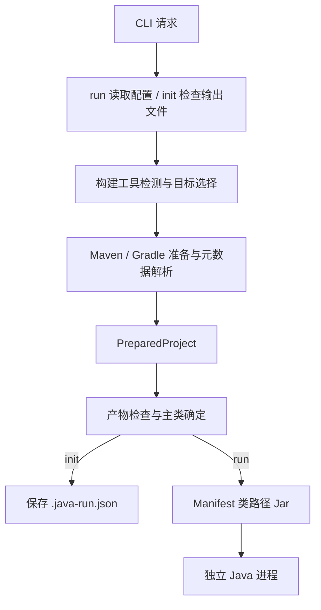

# java-run 架构与运行契约

java-run 是框架中立的 Java 源码工作区运行器。它把“选择一个项目、准备运行产物、确定入口、启动独立 JVM”组织成统一流程，构建模型、依赖版本和项目任务仍由 Maven 或 Gradle 裁决。

统一入口适用于基于 classpath 的 Java 应用，包括普通 main 和 Spring Boot 应用。框架参数沿用 JVM 参数或应用参数的含义；框架类型不进入核心配置。使用方式见 [README](../README.md)，工程能力与后续路线见 [路线规划](roadmap.md)。

## 运行目标

一次运行只启动一个构建项目和一个主类，`init` 保存的配置也对应这个单一目标。多模块工作区中的模块可能是应用，也可能是库；存在编译输出或应用 Java 插件都不能证明它可执行。

模块选择和主类选择分两步完成：

1. Maven 从有效 reactor 中列出 jar 项目，Gradle 从主构建中列出应用 Java 插件的项目。
2. 准备选定项目后，按显式主类、项目声明、已编译入口的顺序确定主类。

自动发现只识别目标输出中的传统 `public static void main(String[])`。未找到入口时要求检查产物或显式配置；发现多个入口时要求选择。显式主类会校验类名语法，实际可加载性和方法有效性由 Java 启动器确认。

交互用于补齐目标和入口信息。标准输入与标准错误均为终端时，CLI 可以展示模块或主类菜单；唯一候选自动采用。普通运行只使用本次选择，`init` 在准备和选择成功后保存结果。非交互环境遇到目标或入口歧义时，需要通过参数明确指定；普通运行也可读取已保存的配置。菜单不询问运行参数，参数由选项或配置提供；取消选择返回 130。

候选发现会运行构建工具。Gradle 配置期间可能需要准备 `buildSrc` 或 included build 的构建逻辑，但发现步骤不主动编译候选应用、解析其运行依赖或读取主类 Provider。

## 请求、计划与准备结果

三个数据契约分别承担不同阶段的职责：

| 契约 | 含义 | 可确认的内容 |
| --- | --- | --- |
| `RunConfig` | 已解析的用户请求 | 工作目录、目标、参数和构建策略 |
| `BuildPlan` | 构建工具执行前的静态准备计划 | 命令、参数边界、工作目录和准备说明 |
| `PreparedProject` | 构建工具裁决后的运行信息 | 目标输出、按顺序排列的类路径、项目入口、启动 JDK 和 JVM 默认参数 |

`run` 与 `plan` 读取解析 `--cwd` 后的工作区根目录中的 `.java-run.json`，不向父目录查找，也不在选定模块后重新读取。CLI 标量覆盖文件配置，数组参数追加到文件数组之后。工具路径由 CLI 指定，项目配置保存可复用的运行目标和参数。

`init` 使用本次 CLI 请求准备目标、检查运行产物并确定主类，然后生成根目录的 `.java-run.json`。配置记录实际构建工具、模块和主类、本次显式提供的参数数组，以及非默认的构建策略和测试类路径设置。构建声明的默认 JVM 参数继续由构建工具提供；`--cwd`、`--java` 和 `--build-command` 不写入配置。

`init` 在任何外部命令执行前检查配置文件是否已存在，默认拒绝覆盖。`--force` 忽略旧配置并重新生成，不读取或合并旧字段，因此可用于替换损坏的 JSON。取消、准备失败或入口无法确定时不写配置。初始化会执行构建准备，但不创建应用 JVM；实际可加载性与入口方法有效性仍在运行时由 Java 启动器确认。

`plan` 只读取本地构建文件和配置，输出准备步骤及待解析信息。它不执行构建工具、不创建临时目录、不交互，也不验证有效模型、主类或依赖文件。`help`、`version` 只解析 CLI 参数，不读取项目配置。

运行与初始化复用同一准备流程：



## 模块职责与依赖

```text
src/
├── cli.ts          请求编排、退出结果与临时工作区生命周期
├── cli/            参数和配置读写、帮助、终端选择
├── build-tools/    构建工具检测、Maven 与 Gradle 适配器
├── core/           运行契约、类路径、主类发现与 Java 启动
└── process/        外部进程、环境覆盖、编码检查与信号处理
```

CLI 依赖具体构建适配器完成准备，适配器返回同一 `PreparedProject`。核心模块检查该结果并确定主类，供 `run` 启动 Java 或 `init` 保存配置。CLI 协调交互选择，核心模块通过调用方提供的选择行为确定入口，不依赖终端菜单实现。核心契约不包含 Spring 等框架字段；进程模块不判断 Maven 或 Gradle 项目语义。

Maven 与 Gradle 的差异集中在 `build-tools/`。各适配器提供计划、候选发现和项目准备函数，使调用方不必理解模型读取和任务图实现。新增构建系统或运行模式时，根据项目样本和结果契约调整接口。

## 构建工具适配

工作目录同时包含 Maven 与 Gradle 构建文件时，必须显式选择工具。构建命令的选择顺序为 CLI 指定命令、工作目录中的 Wrapper、PATH 中的命令。Wrapper 存在但启动失败时保留错误，不回退到另一个版本。

| 策略 | Maven | Gradle |
| --- | --- | --- |
| 默认准备 | 单项目执行 `compile`，包含测试时执行 `test-compile`；指定模块时执行 `-pl <目标> -am install -DskipTests` | 元数据任务依赖目标 source set 的 classes 和 runtimeClasspath 构建依赖，由任务图准备产物 |
| 模型来源 | 固定版本 Help Plugin 输出目标 POM 和 effective POM；Dependency Plugin 输出运行依赖 | 临时 init script 读取目标 source set、runtimeClasspath、application 配置和 Java toolchain |
| 类路径范围 | 目标编译输出加 Maven 裁决的运行依赖 | 目标 source set 的 runtimeClasspath |
| 包含测试 | 测试输出优先于主输出，并解析 test 依赖作用域 | 采用 test runtimeClasspath，同时记录 test 与 main 的输出 |
| `build=none` | 不执行编译或 install，继续解析有效模型和依赖 | 元数据任务不依赖源码构建任务，要求运行产物已经存在 |

Maven 多模块的准备使用本地仓库衔接上游产物。这样，后续单独解析目标依赖时能够读取所选项目及上游模块的构建结果。`install` 可能执行项目绑定到该生命周期的其他插件，只写本地仓库，不执行 `deploy`。当前 Maven 运行目标要求 `packaging=jar`。

Maven 适配器读取工具已经展开的模型，不自行计算属性、继承或依赖冲突。主类元数据采用 `exec.mainClass` 属性或 Exec Maven Plugin 的 `mainClass` 配置。应用启动 JDK 由 `--java`、`JAVA_HOME` 或 PATH 决定，适配器不自动从 Maven toolchains 选择应用启动器。

Gradle init script 只写入本次临时工作区，不改项目构建脚本。元数据任务仅注册到请求的主构建，避免把目标项目路径套用到 `buildSrc` 或 included builds；正常项目依赖和复合构建依赖仍由 Gradle 任务图处理。Gradle application 插件声明的主类和默认 JVM 参数可以成为启动元数据，目标 Java toolchain 提供启动器；`--java` 可以显式覆盖应用启动器。

适配器不主动调用测试目标或测试任务，项目绑定到编译、安装或 classes 的其他行为仍按其构建配置执行。包含测试类路径意味着准备并加载测试输出与依赖。`build=none` 也会执行模型和依赖解析，构建工具可能下载依赖或更新自身缓存；它不等同于静态预览。

构建参数只能调整适配器允许的属性、profile、日志、依赖等选项，不能另行指定项目、生命周期目标、任务列表或 init script。适配器管理的元数据输出和相关属性保持受控，确保请求仍指向一个目标。

## Java 启动

启动模块先检查类路径文件和目标类目录，再确定主类。主类自动发现仅扫描目标项目输出，不把依赖 Jar 或其他应用的入口混入候选。

Java 启动通过临时 Manifest Jar 表达长类路径。Manifest 中的文件路径转换为带正确 URL 编码的 `file:` URL，目录保留尾部斜线，按 UTF-8 字节数折行并使用 CRLF 和终止空行。类路径保留构建工具给出的顺序，只去重相同路径。

应用工作目录为选定项目目录。JVM 参数的排列为默认 `-Dfile.encoding=UTF-8`、项目声明的默认参数、用户配置及 CLI 参数；应用参数位于主类之后。各参数一直保持数组边界，不由通用 shell 重新拆分。临时脚本、元数据和类路径 Jar 在请求结束时统一清理。

框架原生运行任务可能配置额外资源、环境、agent 或自定义 `JavaExec` 行为。通用启动器只使用上述运行契约；依赖这些任务行为的项目应采用原生任务，或明确配置所需启动参数。

## 跨平台进程与编码

外部命令异步执行。构建与元数据命令捕获输出，Java 应用继承终端。捕获模式保留换行和首尾空白，总输出默认限制为 16 MiB；非零退出保留阶段、工作目录、退出码和诊断。应用退出码直接成为 CLI 退出码，命令不存在时返回 127。

POSIX 命令使用独立进程组，转发 `SIGINT`、`SIGTERM`；三秒后升级终止，父进程退出或命令结束时清理该进程树。Windows 批处理入口通过受控 `cmd` 调用保留参数边界，并阻止参数中的 `%NAME%` 被二次展开；终止时用 `taskkill /T /F` 清理进程树，因此不能承诺 POSIX 式的应用优雅关闭。

Windows JDK 原生启动器可能使用系统代码页转换参数，`file.encoding=UTF-8` 不会改变这个转换。执行前按真实 JDK 的原生编码验证非 ASCII 参数；无法完整表示时明确失败，错误不回显原始参数。路径可以保留在 UTF-8 元数据和 Manifest 中：Gradle 的项目根、目标和输出路径从临时脚本中的请求读取，Java 的类路径 Jar 参数相对目标项目目录计算，Jar 命令在临时目录中使用相对文件名。

Maven 启动脚本还会注入配置根目录。Windows 适配器保留显式 `MAVEN_BASEDIR` 或最近 `.mvn` 祖先的含义，规范化已有目录的原生路径以展开 8.3 别名。配置根无法经 JDK 编码完整传递时，先以相对配置根加载 `.mvn`，再通过子环境恢复模型中的绝对根；此路径要求 Maven 3.9.2 或更新版本。子环境覆盖不改变父进程环境。

## 支持范围与演进原则

当前契约围绕 Maven jar、Gradle Java source set 和传统 Java main 建立。JPMS、Android、native image、部署和服务守护不在支持范围。Gradle application 声明 `mainModule` 时会明确拒绝。

工具不保存独立的类路径缓存；每次请求由构建工具重新裁决，下载缓存和增量构建由其自身维护。性能优化应围绕模型调用次数、配置成本和真实项目测量展开，同时保留依赖、资源和目标隔离的正确性。

验证通过参数与配置契约、真实 JDK 启动、Maven / Gradle 项目夹具和原生二进制验收组成。支持范围的扩大以可运行样本和对应验收为依据，构建出某个平台产物本身不等于验证过该平台。
