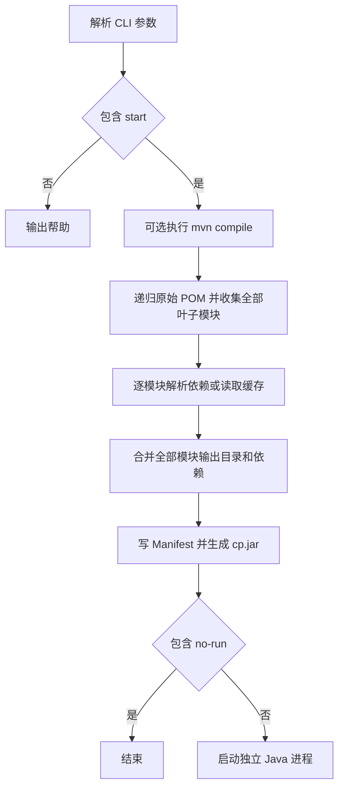

# java-run 实现评估与开源技术路线

评估日期：2026-10-05。代码基线：`000c23bc2f11ad80224c179cd12e1757a5b5c09b`，包版本 `0.0.5`。目标按本次讨论确定为通用开源 CLI。

**当前项目已经完成特定项目启动工具的主流程，并具备自动发布能力，但尚未达到可对陌生 Maven 项目承诺兼容的阶段。** 最值得保留的是 TypeScript / Bun 工具链、独立 Java 进程、长类路径处理思路和已有发布流程。下一步的重点是运行正确性、Maven 语义和可重复验证。

建议继续投入，先以 Maven / Spring Boot 开发启动为明确范围。短期修复可复现问题；中期以启动模块为中心，让 Maven 负责模型与依赖裁决；随后用真实项目夹具和原生操作系统测试支撑支持范围。性能优化应在正确性基线建立后进行。


> 本文评估重构前的固定代码基线。用户随后允许重新定位并加入 Gradle，本次实施改为框架中立的源码工作区运行器；最终契约见 [产品设计](product-design.md)，结果见 [实施记录](implementation-plan.md)。以下源码链接均指向原始基线。

## 评估范围与证据

本次阅读了全部 8 个 TypeScript 源文件、README、配置、构建脚本、发布工作流及本地可见的 17 个提交。在隔离副本安装锁定依赖，执行类型检查、本机编译及针对性探针；查阅 Maven、Java、Spring Boot、Bun 和 Exec Maven Plugin 官方资料。

文中的“已复现”指本地实际执行，“源码确认”指实现直接体现的行为，“风险推断”指结合实现与官方语义得出的可能后果，“建议”指后续方案。

本次没有运行完整 Jeecg 或 Spring Boot 项目，没有执行真实多模块 Maven reactor 集成验证，没有测试 Windows / Linux 二进制，也没有检验线上 Release 产物。对 Maven 依赖缓存的探针使用模拟 `mvn`，只证明本工具的缓存控制行为。不能把这些结果扩大为完整兼容性验收。

## 实现现状

当前执行链如下；`main=` 只改变启动类，并不选择或收窄 Maven 模块。



| 能力 | 当前实现 | 面向通用工具的评价 |
| --- | --- | --- |
| 模块发现 | 递归静态 `<modules>`，提取叶子模块；单模块可作为根模块返回 | 基础流程成立，但不是 Maven 有效模型 |
| 依赖解析 | 调用 `dependency:build-classpath`，读取输出文件并去重 | 复用了 Maven，但逐模块解析后取并集丢失了目标应用语义 |
| 工作区输出 | 加入已有 `target/classes` 和 `target/test-classes`，按路径后缀排除模块 Jar | 固定目录和坐标拼接适用于有限结构 |
| 启动与配置 | 独立 Java 进程，支持主类、Spring profile、本地 profile 前缀和可选编译 | 主要入口齐备，仍绑定 Jeecg 默认主类；缺目标模块和通用参数转发 |
| 缓存 | 按模块绝对路径生成文件名，支持 `-r` | 有性能意识，失效条件不足 |
| 长类路径 | 使用 Manifest 和 `cp.jar` | 方向可保留，路径编码存在已复现问题 |
| 分发 | 本机编译，tag 触发五种 OS / 架构产物构建与 Release | 构建目标已有覆盖，目标系统运行尚无验证门禁 |

源码入口：[主流程](https://github.com/Vanisper/java-run/blob/000c23bc2f11ad80224c179cd12e1757a5b5c09b/src/cli.ts)、[模块发现](https://github.com/Vanisper/java-run/blob/000c23bc2f11ad80224c179cd12e1757a5b5c09b/src/find-maven-modules.ts)、[类路径构建](https://github.com/Vanisper/java-run/blob/000c23bc2f11ad80224c179cd12e1757a5b5c09b/src/classpath-builder.ts)、[发布流程](https://github.com/Vanisper/java-run/blob/000c23bc2f11ad80224c179cd12e1757a5b5c09b/.github/workflows/release.yaml)。

以下语义需要在文档中明确：`active=` 是 Spring profile，不是 Maven `-P`；`no-run` 仍解析依赖并写缓存、生成 Jar，不是无副作用的 dry-run；`-c` 只执行 `mvn compile`，不能据此保证后续逐模块解析能找到未安装的兄弟模块产物。

## 需要优先处理的实现问题

### Java 正常退出后被 CLI 判为失败

**已复现，稳定版本的阻断项。** [exec.ts](https://github.com/Vanisper/java-run/blob/000c23bc2f11ad80224c179cd12e1757a5b5c09b/src/exec.ts) 第 16 行在 `stdout` 不是 Buffer 时直接调用 `.trim()`；[cli.ts](https://github.com/Vanisper/java-run/blob/000c23bc2f11ad80224c179cd12e1757a5b5c09b/src/cli.ts) 第 80 行使用 `stdio: 'inherit'`，此时成功结束的子进程没有可捕获的 stdout。

本地调用 `executeCommand('java', ['-version'], { stdio: 'inherit' })` 后，Java 正常退出，CLI 却因 `null.trim()` 抛错并返回 1。相同执行路径用于应用运行，因此应用正常关闭后也可能被报告为失败。这不表示 Java 一定无法启动。

建议把“捕获输出”和“继承终端”作为明确的执行模式，返回结构化结果，包含退出码、信号和可选输出。进程内部工具函数不直接 `process.exit`，由 CLI 顶层决定退出行为，并保留子进程失败原因。

### Manifest 路径编码会导致类加载失败

**已复现，稳定版本的阻断项。** [cli.ts](https://github.com/Vanisper/java-run/blob/000c23bc2f11ad80224c179cd12e1757a5b5c09b/src/cli.ts) 第 115 行直接将路径拼为 `file://...`，没有 URL 编码。使用同样的 Manifest 生成逻辑、真实 `javac` / `jar` / `java` 验证，普通目录可运行；目录含空格或 `#` 时出现 `ClassNotFoundException`。

建议使用标准路径到 URL 的转换，保持目录 URL 的尾部斜杠，并验证最终 Jar。Manifest 的行长限制按 UTF-8 字节计算；当前按字符串字符切行值得修正，但 `jar` 可能重新折行，本次中文目录样例成功，不能据源码直接断言中文必然失败。Windows 盘符及 UNC 路径仍需原生测试。[JAR 规范](https://docs.oracle.com/en/java/javase/21/docs/specs/jar/jar.html)、[pathToFileURL](https://nodejs.org/api/url.html#urlpathtofileurlpath-options)

### 测试类路径开关没有生效

**测试目录问题已复现，依赖作用域问题由源码和官方文档确认。** [classpath-builder.ts](https://github.com/Vanisper/java-run/blob/000c23bc2f11ad80224c179cd12e1757a5b5c09b/src/classpath-builder.ts) 第 21、31 行无条件枚举 `classes` 与 `test-classes`，没有读取 `includeTests`；调用方传入 `false` 仍会包含测试输出。

第 79 行的 Maven 调用没有指定依赖作用域。`dependency:build-classpath` 默认包含所有依赖；普通运行时通常应使用 `-DincludeScope=runtime`。第 82 行的注释参数 `-Dmdep.includeScope=compile,runtime` 不能直接取消注释作为修复。测试输出目录和测试依赖需要同时控制，具体 Boot 开发启动语义则应遵循选定后端的契约。[插件参数](https://maven.apache.org/plugins/maven-dependency-plugin/build-classpath-mojo.html)

### 缓存可能持续返回旧依赖

**已复现。** [classpath-builder.ts](https://github.com/Vanisper/java-run/blob/000c23bc2f11ad80224c179cd12e1757a5b5c09b/src/classpath-builder.ts) 第 69 行只检查缓存文件及模块 `target` 是否存在。探针将 POM 中依赖从 v1 改为 v2，第二次仍读取 v1，模拟 Maven 的调用次数没有增加；强制刷新才得到 v2。

建议第一步采用保守失效或默认重新解析，先保证结果正确。恢复缓存时，至少区分目标模块、相关 POM / 父模型、Maven profiles、属性、scope、工具链与缓存格式版本，检查引用文件存在性。外部父模型、SNAPSHOT 和 settings 变化需要额外策略；不能承诺一个根 POM 哈希解决全部问题。缓存写入应原子化，失败结果不得覆盖有效记录。

### 原始 XML 与 Maven 有效模型存在差距

**多项边界已复现。** [find-maven-modules.ts](https://github.com/Vanisper/java-run/blob/000c23bc2f11ad80224c179cd12e1757a5b5c09b/src/find-maven-modules.ts) 第 29 行只读顶层 modules，第 32 行直接读版本文本，第 52 行固定追加 `pom.xml`。探针结果包括：

- 默认激活 profile 内的模块未被发现，聚合根被当成叶子
- `${revision}` 没有展开，随后参与模块 Jar 排除时匹配失败
- module 指向具体 POM 文件时无法识别
- 缺失子 POM 被跳过，畸形 XML 被记录后仍返回其余模块

最后一项表示模块发现函数无法明确报告不完整结果；真实 CLI 后续 Maven 步骤可能报错，不能推断一定会带着错误模块集启动。

建议将原始 XML 解析限于快速发现和提示，把 profile、继承、属性插值、依赖管理交给 Maven。`help:effective-pom` 可帮助获取有效模型，但它不等于解析后的依赖图或 classpath。[Model Builder](https://maven.apache.org/ref/3.9.11/maven-model-builder/)、[effective-pom](https://maven.apache.org/plugins/maven-help-plugin/effective-pom-mojo.html)、[POM 聚合定义](https://maven.apache.org/pom.html#aggregation-or-multi-module)

### 所有叶子模块的并集不能代表一个应用

**行为由源码确认，冲突后果属于风险推断。** [cli.ts](https://github.com/Vanisper/java-run/blob/000c23bc2f11ad80224c179cd12e1757a5b5c09b/src/cli.ts) 第 97 行获取全部叶子模块，[classpath-builder.ts](https://github.com/Vanisper/java-run/blob/000c23bc2f11ad80224c179cd12e1757a5b5c09b/src/classpath-builder.ts) 第 29、43、108 行合并所有输出与依赖，只按路径去重。

例如仓库包含 `app-a` 与 `app-b`，分别依赖某库的 v1 和 v2，启动 `app-a` 时也可能带入 `app-b` 的目录及 v2。两个不同 Jar 路径不会被 Set 去掉；重复类和配置资源的加载顺序可能受到无关模块影响。本次未运行这一完整框架冲突场景。

Maven 的版本裁决以当前项目的依赖图为依据。因此，通用化应先确定启动模块，再取得该模块经 Maven 裁决的依赖闭包和顺序；聚合关系不能替代依赖关系。[Maven 依赖机制](https://maven.apache.org/guides/introduction/introduction-to-dependency-mechanism.html)

### 参数和诊断契约需要收紧

**参数与空依赖问题已复现，其余由源码确认。**

| 问题 | 证据 | 建议 |
| --- | --- | --- |
| 键名前缀误匹配 | `mainframe=example.App` 被当成 main；`activeX=prod` 被当成 active | 精确匹配参数名，拒绝未知参数，说明重复参数策略 |
| 值被截断 | `main=a=b` 只保留 b；解析器的 separator 参数未使用 | 只按第一个分隔符切分，再验证取值 |
| 空依赖变成 cwd | 空字符串经过 `resolve('')`，意外进入 classpath | 去掉空记录并验证路径类别 |
| 错误输出丢失 | executor 主要输出 `result.error`；stderr 被注释，依赖失败主要拼 stdout | 保留命令阶段、cwd、退出码、stderr，并区分找不到程序与命令执行失败 |
| 导入即写缓存目录 | classpath 模块顶层执行 `mkdirSync` | 将文件写入移动到显式执行阶段，让帮助和参数验证可以独立运行 |

依据：[参数解析](https://github.com/Vanisper/java-run/blob/000c23bc2f11ad80224c179cd12e1757a5b5c09b/src/parse-argvs.ts) 第 17 至 23 行、[类路径构建](https://github.com/Vanisper/java-run/blob/000c23bc2f11ad80224c179cd12e1757a5b5c09b/src/classpath-builder.ts) 第 16、89、108 行、[执行器](https://github.com/Vanisper/java-run/blob/000c23bc2f11ad80224c179cd12e1757a5b5c09b/src/exec.ts) 第 9 至 16 行。

## 工程能力评价

本评价针对仓库展示出的工程证据。它不能单独用于判断作者的职级、其他项目经验或能力上限，也不以是否使用大型框架作为成熟度标准。

| 维度 | 已展示的能力 | 当前需要补足的证据 |
| --- | --- | --- |
| 问题识别与实现 | 从脱离 IDE 的真实需求出发，实现完整启动链 | 独立项目的适用性验证和明确支持范围 |
| 工具集成 | 能组织 Maven、JDK、文件系统、编码和命令行流程 | 外部工具的失败契约与复杂 Maven 语义 |
| 代码组织 | 执行、参数、模块发现和类路径已拆分；启用 strict，本次类型检查通过 | 显式 cwd / 配置边界、少量纯函数、去除全局状态及导入副作用 |
| 交付自动化 | bumpp、版本 tag、自动生成说明、五个二进制目标 | 固定工具链、正确绑定触发 tag、运行验证后发布 |
| 质量保障 | 历史中持续修复编码、路径和错误提示 | 仓库没有测试与 fixture；修复尚未固化为回归保护 |
| 跨平台意识 | 分隔符适配、输出编码处理、多平台构建 | Windows / Linux / macOS 原生启动、退出和路径测试 |
| 开源使用体验 | 有帮助示例，README 坦诚说明 Jeecg 来源与待验证项 | 安装说明、兼容表、故障排查、许可证、贡献入口 |

**总体判断：已经证明场景驱动的实现与交付能力；通用工具所需的语义建模、边界验证和维护保障尚未形成完整证据。** 发布自动化领先于质量验证，是本项目当前最明显的不平衡。

当前源码约 493 行，保持简单是优点。改进不需要 DI 框架、插件市场或多层服务架构；明确运行配置、启动计划和进程执行三个边界即可显著降低维护成本。

发布流程还存在具体改进点：[release.yaml](https://github.com/Vanisper/java-run/blob/000c23bc2f11ad80224c179cd12e1757a5b5c09b/.github/workflows/release.yaml) 第 24 行取全仓库最高版本 tag，而非本次触发 tag，重跑旧 tag 可能产生错误版本名或日志范围；第 76 行附近把提交文本直接插入 shell，应改为可靠的数据传递或标准发布说明机制。现有工作流只在 tag 触发，未包含 PR 类型检查、测试或目标系统运行检查。

已提交 `bun.lockb` 是可复现性的基础，本次 frozen 安装成功。仍应固定 Bun 版本，并让 CI 显式执行锁文件安装、类型检查和测试；仅保留 strict 配置无法覆盖进程输出等运行时契约。

## 技术路线选择

### 保留技术栈并缩小首版支持承诺

建议保留 TypeScript / Bun。官方已经支持独立可执行文件和跨平台编译，当前也实际完成了本机构建，没有证据表明换成 Go、Rust 或 Java 能直接解决主要问题。[Bun 可执行文件文档](https://bun.com/docs/bundler/executables)

首个通用 alpha 建议优先支持 **Maven 3 的 Spring Boot 开发启动**，以显式目标模块为入口，再扩展普通 Java main。建议先将 JDK 17 / 21 纳入验证矩阵；这些是拟定范围，不能标成已经支持。Maven 4、旧 JDK、Gradle、JPMS、WAR 容器与复杂 attached artifacts 逐项按需求验证后加入。

产品价值应落在更简单的启动配置、Wrapper / 工具链发现、错误解释、可检查的运行计划和可靠的跨平台分发。自有快速启动模式需要用实际数据证明收益；不应把绕过 Maven 本身当成目标。

### 先建立 Maven 托管执行的正确性基线

| 方案 | 优点 | 主要成本 | 建议 |
| --- | --- | --- | --- |
| 持续扩展当前 XML 解析器 | 延续现有代码与缓存 | Maven 特例会持续增加，依赖正确性难保证 | 不作为通用化主路线 |
| CLI 编排 `spring-boot:run` | 尊重 Boot 项目插件配置，已有 JVM / 应用参数和 profile 契约 | 处理目标模块、构建准备、版本差异与参数映射 | 第一阶段优先验证的正式后端 |
| CLI 编排 `exec:exec` | 普通 Java main、独立 JVM、Maven 生成 classpath | 插件版本、参数引用、长类路径和 reactor 产物准备 | 普通 Java 支持的后续候选 |
| Maven 解析加自有 launcher | 可缓存解析结果、减少重复 Maven 启动、控制工作区输出 | 需要证明依赖顺序、缓存、进程和路径行为一致 | 保留为受限模式，通过对照验收后扩大范围 |
| 新建 Maven 桥接插件 | 可直接取得 MavenProject / session 等信息 | 增加 JVM 组件和发布维护面 | 仅在现有插件无法满足已验证需求时采用 |

`exec:java` 在 Maven JVM 内执行，其线程和 JVM 参数行为不能简单等同于独立 Java 进程，因此不建议作为长期运行服务的默认后端。`exec:exec` 有 `%classpath` 和长类路径支持，说明当前 cp.jar 思路有成熟先例。[Exec 用法](https://www.mojohaus.org/exec-maven-plugin/usage.html)、[Exec Java 示例](https://www.mojohaus.org/exec-maven-plugin/examples/example-exec-for-java-programs.html)、[Exec 参数](https://www.mojohaus.org/exec-maven-plugin/exec-mojo.html)

首轮只实现一个正式后端即可。Boot run 使用独立进程并提供应用参数、JVM 参数和测试 classpath 配置，应优先复用这些契约。[Spring Boot run](https://docs.spring.io/spring-boot/maven-plugin/run.html)

多模块构建与启动应明确分开：先准备目标及其依赖，再只运行目标。不能直接用 `-pl app -am spring-boot:run` 假定只会运行 app；Spring 官方多模块示例先 install，再对 application 模块执行 run。若暂时要求上游模块已安装，应明确说明；若提供准备命令，应把 install 作为显式选项。避免 install 的同会话 reactor 方案需要单独验证。[Spring 多模块指南](https://spring.io/guides/gs/multi-module/)、[Maven reactor](https://maven.apache.org/guides/mini/guide-multiple-modules.html)

### 建立小而明确的内部边界

建议的流程是：


- `RunConfig`：明确 cwd、目标模块、运行后端、Spring profiles、Maven profiles、JVM 参数、应用参数及构建策略
- `LaunchPlan`：列出需要执行的步骤、可执行文件、参数数组、工作目录及解析来源，支持预览和问题复现
- `ProcessRunner`：统一处理输出模式、失败结果、退出码与信号；平台差异集中在此边界

Maven 托管后端可以在执行时解析依赖；计划中应明确这一点。未来自有 launcher 的计划则需要保存经 Maven 裁决的有序 classpath。不能为了统一类型，假装两者都已完成同样的解析。

优先使用项目 Maven Wrapper，再回退到显式配置或 PATH 中的 Maven。Wrapper 存在但执行失败时，应报告原因，避免悄悄换版本。Windows 的 `mvnw.cmd` 调用和带空格参数必须在 Windows 上测试。[Maven Wrapper](https://maven.apache.org/tools/wrapper/)

进程长期运行时宜采用异步 spawn，显式验证 Ctrl-C、终止信号和退出码传播。保留参数数组，避免把用户参数拼接为通用 shell 字符串。启动计划和调试日志需要避免输出敏感属性值。

## 分阶段实施计划

以下是规划估算，按一名熟悉 TypeScript / Maven 的开发者、可使用三平台 CI、第一版仅完成一个正式后端计算。外部私服、复杂插件和旧 JDK 适配可能增加投入，工期不是交付承诺。

| 阶段 | 预计投入 | 主要交付 | 退出条件 |
| --- | --- | --- | --- |
| A 修复并建立回归保护 | 2 至 4 人日 | 执行器、URL 路径、参数、测试目录及 scope、保守缓存策略；typecheck / test / PR 校验 | 本阶段缺陷有回归测试，正常与失败退出正确，Jeecg 场景补实跑；其余模型边界登记为限制，交阶段 B 验收 |
| B 建立通用运行基线 | 5 至 10 人日 | 目标模块、RunConfig / LaunchPlan、Wrapper、Maven 与 Spring profile 分离、一个 Maven 托管后端 | 单模块和 app→lib 正常启动，无关 app 不参与；干净工作区的构建前提明确可复现 |
| C 完成开源 alpha 分发 | 4 至 7 人日 | 原生三平台 smoke、固定工具链、修发布 tag、安装与排障文档、支持表、许可证、产物校验 | 对外声明的每个 OS / 架构有对应证据；无 Bun 环境可运行产物 |
| D 按数据优化快速模式 | 另计 5 至 10 人日 | Maven 权威解析结果缓存、自有 launcher 对照验证、性能基准 | 依赖与资源选择符合约定，缓存失效正确，温启动收益可测量且不损害正确性 |

前三阶段约 11 至 21 人日，可按 2 至 4 个工程周加必要缓冲规划。阶段 D 不进入首个 alpha 的必要范围。版本号应表达真实支持范围，不以新增参数数量作为发布标准。

建议先拆出三个可审查的工作包：

1. **执行与路径正确性**：修复 inherited stdio、退出结果、特殊路径及参数解析；提交对应回归用例与 CI 校验。
2. **启动目标与 Maven 基线**：明确支持矩阵，选择启动模块，验证 Boot 后端和多模块准备流程，输出可检查的运行计划。
3. **跨平台 alpha 发布**：补原生运行矩阵、固定构建环境、修正 tag 来源，完成 README、安装示例、排障和许可证。

## 验收矩阵

测试应围绕用户可观察的契约，不追求镜像实现或单纯覆盖率数字。最小集如下：

| 场景 | 必须观察到的结果 |
| --- | --- |
| 单模块 Boot 与原有 Jeecg | 明确主类或插件配置后能启动；原场景无回归 |
| app 依赖 lib | 使用预期版本和最新构建结果；未准备依赖时给明确提示 |
| 同仓库两个独立 app | 启动一个不会加入另一个的类、配置和冲突版本 |
| profile 与属性坐标 | Maven profile、Spring profile 分别生效；`${revision}` 由 Maven 正确处理 |
| 测试隔离 | 默认行为符合后端契约；开启测试模式时同时处理测试输出和依赖 |
| 空格、中文、`#`、`%` 路径 | 主类、依赖和资源可实际加载；Windows 盘符另行覆盖 |
| 正常退出、非零退出、Ctrl-C | CLI 退出结果符合约定；目标支持平台无遗留 Java 子进程 |
| 缺 Maven / Java、错误 POM | 明确失败阶段与可行动提示，不返回不完整的成功结果 |
| POM / 父模型 / profile 变化 | 重新解析或明确使缓存失效；结果可解释 |
| 无 Bun 环境的发布二进制 | 可执行帮助及真实启动样例 |

自有 launcher 正式启用前，再加入自定义 outputDirectory、classifier、长 classpath、空依赖、缓存并发写入与 SNAPSHOT 策略测试。当前五种二进制构建目标不能直接转成五种已验证支持承诺；无法提供原生验证的目标应明确标注实验状态。

性能指标建议分别记录冷解析、温启动、缓存失效后的启动耗时和 Maven 子进程次数，并与选定的官方运行方式对照。本次未做性能基准，现阶段不设没有依据的提速百分比。

## 本次验证记录

原始代码与依赖安装、编译产物均放在临时副本，项目业务源码未改动。主验证环境为 macOS arm64、Bun 1.4.2、JDK 21.0.12.1；锁定安装得到 TypeScript 5.8.2 和 `@types/bun` 1.2.5。Maven 3.9.16 已检测可用，但本次未完成真实 reactor 集成测试。

| 检查 | 结果 | 证明范围 |
| --- | --- | --- |
| `bun install --frozen-lockfile --ignore-scripts` | 通过，安装 53 个包 | 当前环境可按已有锁文件安装 |
| `./node_modules/.bin/tsc --noEmit` | 通过 | 当前静态类型检查通过，不代表运行时契约正确 |
| `bun run compile` | 通过，打包 133 个模块 | 本机可生成独立二进制 |
| `./dist/java-run --help` | 退出 0 | 本机产物的帮助入口可运行 |
| inherited stdio 执行 `java -version` | Java 成功后出现 `null.trim()`，CLI 退出 1 | 已复现执行器结果处理缺陷 |
| 按现有逻辑生成 cp.jar 并运行 Hello | 普通路径、中文路径成功；空格、`#` 路径失败 | 已复现 URL 编码影响类加载 |
| 模块与参数探针 | profile、属性版本、自定义 POM、参数前缀等边界失败 | 已证明工具自身解析行为 |
| 模拟 Maven 的类路径与缓存探针 | `includeTests:false` 仍含测试目录；POM 改动后仍用旧缓存 | 已证明配置与失效逻辑缺陷，不代替真实 Maven 集成 |

执行器复现命令，在安装依赖后的仓库副本运行：

```sh
bun -e 'import { executeCommand } from "./src/exec.ts"; executeCommand("java", ["-version"], { stdio: "inherit" });'
```

参数复现命令：

```sh
bun -e 'import p from "./src/parse-argvs.ts"; p.set(["mainframe=example.App", "active=prod=blue"]); console.log(p.key("main"), p.key("active"));'
```

当前输出为 `example.App blue`。前者错误接受了非 main 参数，后者丢失了值的前段。

本报告是后续实现与验收的基线。随着阶段 A 至 C 完成，应更新已复现问题的状态和兼容矩阵，而不是继续沿用本次评估时的结论。
