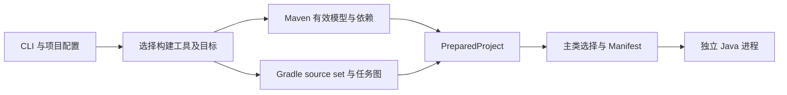

# java-run 产品定位与运行契约

java-run 是框架中立的 Java 源码工作区运行器。它为 Maven 与 Gradle 项目提供统一的开发启动入口，并将构建模型、依赖裁决和增量编译保留在构建工具中。本轮以这个定位完成重构，替代原评估报告中优先特殊化 Spring Boot 的实施建议。

## 用户需要掌握的内容

项目中执行 `java-run` 即启动默认应用。多模块项目在 `.java-run.json` 保存启动目标和参数，随后无需重复输入。终端中缺少模块或存在多个主类时，通过序号菜单补齐目标；非交互环境明确要求配置。菜单只选择模块或主类，不逐项询问运行参数，也不自动写入配置。

构建模块不等于可执行应用。Maven 候选为有效 reactor 中的 jar 项目，Gradle 候选为应用 Java 插件的项目；库也可能出现在列表中，因此标注入口尚未确认。主类在选定项目准备之后才最终确定。发现候选会执行构建工具配置，Gradle 的 buildSrc / included builds 可能准备构建逻辑，但不主动编译候选应用或解析其运行依赖。

命令只分为 `run`、`plan`、`help`、`version`。`plan` 读取本地项目配置并预览构建步骤，不执行构建工具，也不生成项目缓存；它明确表示主类和类路径仍待构建工具解析。

常用选项为 `--cwd`、`--module`、`--main`、`--jvm-arg`、`--arg`。高级用户可以选择 `--tool=maven|gradle`、`--build=none`、`--build-arg`、`--include-tests`、`--java` 和 `--build-command`。没有专用 Spring profile 参数，Spring 参数通过正常 JVM 或应用参数传递。

## 自动准备的含义

Maven 单项目自动编译；选定 reactor 模块时，自动 install 该模块和上游依赖，再只解析选定模块的运行类路径。这里的 install 是 Maven 的本地仓库操作，计划和运行提示都会说明，不会发布到远程仓库。当前选择这个保守方案，是为了避免单独解析模块时读取缺失或陈旧的兄弟模块 Jar。

Gradle 将 classes 与项目依赖交给任务图，不先单独编译每个模块，也不做 Maven 式的 install。通过临时 init script 获取选定项目的主 source set 和运行依赖；不改用户的构建脚本。初始化逻辑限定在请求的主构建，避免将目标路径套用到 buildSrc 或 included builds；复合构建的正常依赖任务仍由 Gradle 执行。`--build=none` 在两种工具中都表示不主动构建应用源码，缺失产物直接报错。

不会单独执行测试；`--include-tests` 只准备并加入测试输出和测试依赖。默认使用正常运行时依赖。重新解析依赖由构建工具自身缓存加速，java-run 不维护独立的失效不完整的 classpath 缓存。

## 框架与技术栈

Spring Boot、普通 Java main 和其他基于 classpath 的应用共享启动机制。Gradle 已有 application 的 mainClass 和默认 JVM 参数可以作为元数据；框架专用 run 任务的额外逻辑不自动模拟。如果用户依赖 bootRun 或自定义 JavaExec 的特殊环境、agents、附加资源，应继续使用该原生任务或显式配置，不宣称通用 runner 与所有任务等价。

目前保留 TypeScript / Bun，原因是 CLI、跨平台二进制和进程编排已有可用基础。关键改动在产品契约与构建工具适配，语言切换不能替代这项工作。JPMS、Android、native image、部署与服务守护不属于首版的支持范围。

## 内部模块与验证

CLI 解析配置，构建工具模块生成经过裁决的 PreparedProject，主类模块选择入口，启动模块生成 URL 编码正确的 classpath Jar，执行模块负责退出和信号。Maven 与 Gradle 是真实存在的两种适配器，框架不进入核心配置类型。

源码按职责集中，入口与实现目录如下：

```text
src/
├── cli.ts                 # CLI 请求编排与进程入口
├── cli/                   # 参数、帮助、交互选择
├── build-tools/           # 工具检测、Maven 与 Gradle 适配
├── core/                  # 运行契约、主类、类路径、Java 启动
└── process/               # 外部命令、退出状态与信号处理
```



验证以同一契约覆盖两种工具：单项目、多模块依赖、无关项目隔离、参数边界、测试隔离、POM 或 Gradle 构建变更、特殊路径、正常和失败退出。用户提供的 java-template 作为 Gradle 实例补充验证，不修改其源仓库。

## 后续技术路线

| 阶段 | 交付目标 | 进入下一阶段的依据 |
| --- | --- | --- |
| 本轮重构 | 两种构建工具、统一运行契约、交互补选、真实夹具、原生 CI 与发布门禁 | 本地验收与实现记录可复现 |
| 首个通用版本 | 确定许可证和版本号，完成三种原生系统的 CI 验证，确认 Wrapper 与 JDK 支持矩阵 | 原生 CI 实际通过，兼容边界和迁移说明可公开 |
| 使用体验与性能 | 基于真实使用反馈决定命名运行配置、诊断命令，以及减少 Maven 多次启动和 Gradle 配置开销 | 有具体重复操作或可测量耗时，不恢复失效不完整的 classpath 缓存 |
| 扩展运行模式 | 评估 JPMS、现代 main、原生任务集成等独立需求 | 存在可验证的项目样本和明确契约，再扩展适配器 |

TypeScript / Bun 继续承担 CLI 和进程编排，Gradle 脚本只承担构建模型读取。暂不为框架建立插件系统；当第三种真实运行模式出现时，再根据数据边界设计扩展接口。
